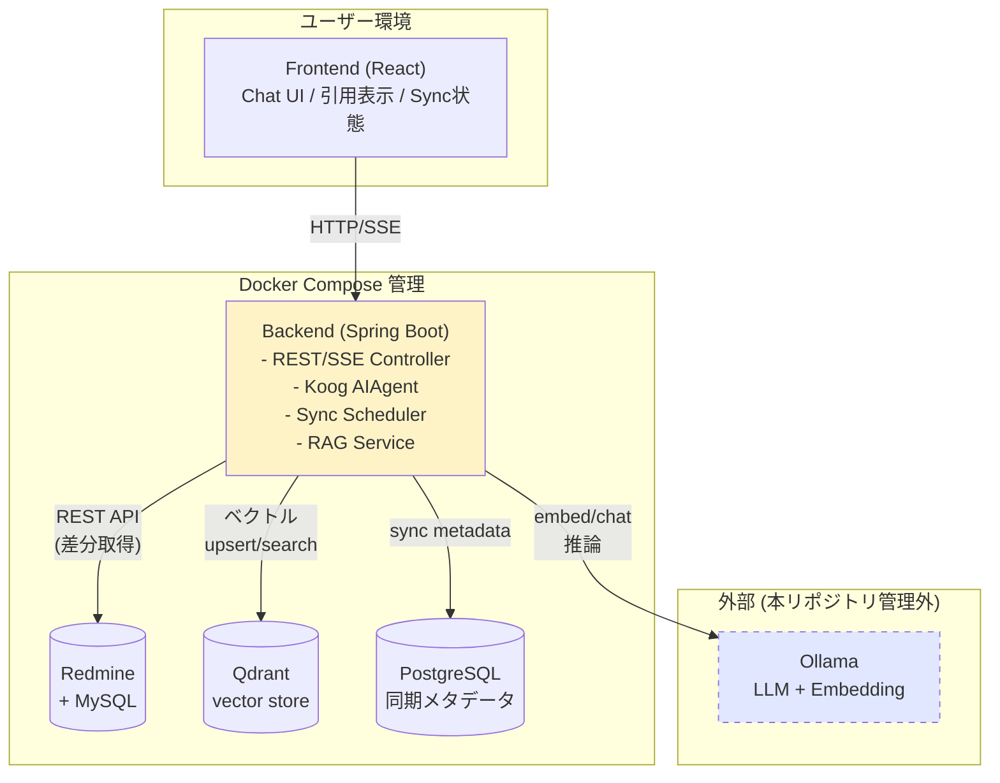
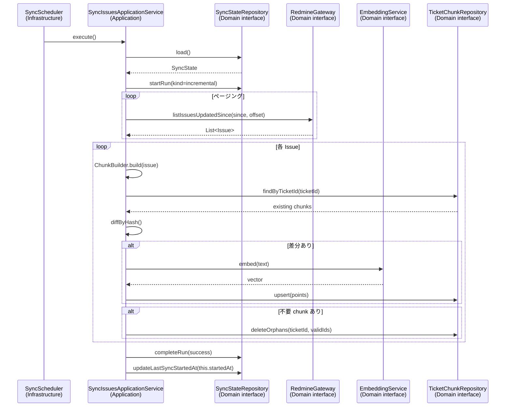
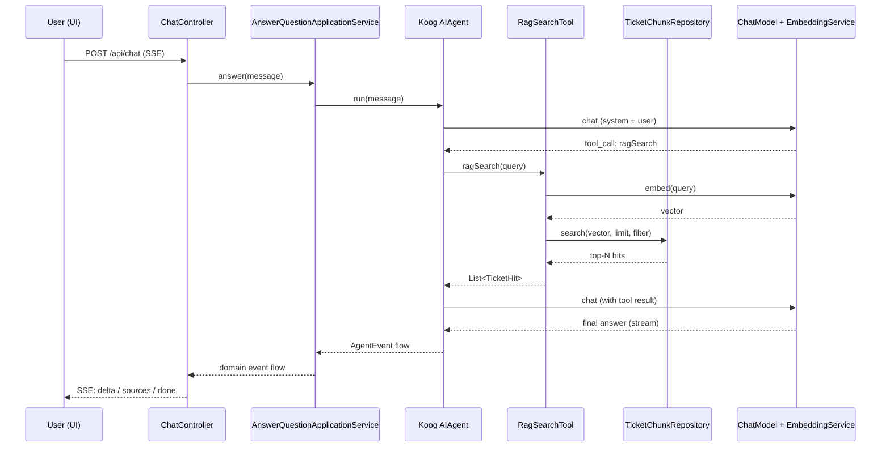
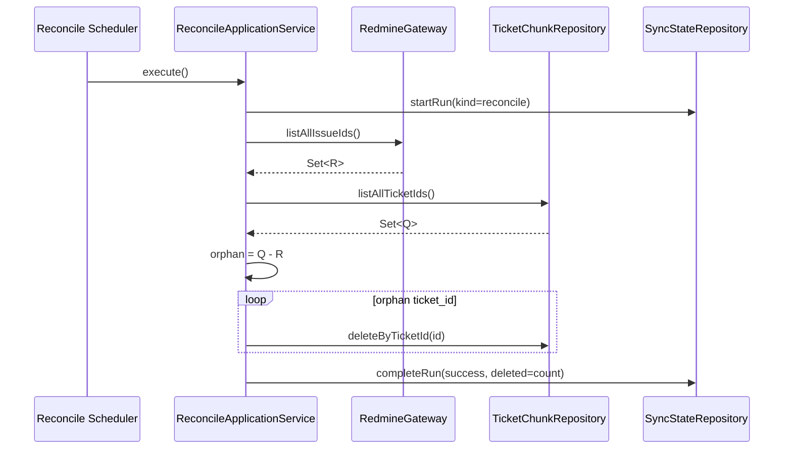

# 設計書 (01-design.md)

本書はシステム全体の **設計** を記述する。命名規約・コーディングスタイル・テストの書き方の詳細ルールは `CLAUDE.md` と `.claude/rules/` に分割管理しているので、そちらを参照すること。

## 1. 目的とスコープ

### 1.1 目的

Redmine に蓄積された過去チケット (障害対応・問い合わせ・タスクの履歴) をナレッジソースとして活用し、自然言語による類似事例検索を可能にする AI エージェントを構築する。

### 1.2 スコープ

#### In Scope

- Redmine からチケット情報を REST API 経由で定期取得
- チケットの description / journals をチャンク化し、ベクトル化して Qdrant に永続化
- 差分同期 (更新があったチケットのみ取得・上書き)
- 削除されたチケットの検出・除去 (Reconciliation)
- Koog による AI エージェントの構築 (RAG をツールとして公開)
- React フロントエンド経由での対話型 QA UI
- ローカル Ollama に接続して LLM・Embedding 推論を実行

#### Out of Scope (本フェーズ)

- 認証・認可機構 (ローカル運用前提)
- マルチテナント
- Redmine 添付ファイル / Wiki / カスタムフィールドの取り込み
- AI エージェントによる Redmine への書き込み (チケット作成等)
- Ollama のセットアップ・モデル管理 (別 repo で管理)

### 1.3 想定スケール

| 項目             | 規模                  |
| ---------------- | --------------------- |
| チケット総数     | 〜数千件              |
| 同時利用ユーザー | 1〜数人               |
| 同期頻度         | 1 時間に 1 回 (cron)  |
| 期待レスポンス   | チャット応答 〜10 秒  |

## 2. システム構成

### 2.1 コンポーネント図



### 2.2 コンテナ構成

| サービス名     | イメージ / ベース             | ポート (host) | 役割                          |
| -------------- | ---------------------------- | ------------- | ----------------------------- |
| `frontend`     | node:24-bookworm-slim + Vite | 5173          | UI                            |
| `backend`      | eclipse-temurin:25 + Gradle  | 8080          | API + バッチ + エージェント   |
| `redmine`      | redmine:5                    | 3000          | チケット格納                  |
| `redmine-db`   | mysql:8                      | (内部のみ)    | Redmine 用 RDB                |
| `qdrant`       | qdrant/qdrant:latest         | 6333, 6334    | ベクトルストア                |
| `app-db`       | postgres:16                  | 5432          | 同期状態メタデータ            |

外部依存 (Compose 管理外):

| 依存       | 想定接続先                                    |
| ---------- | --------------------------------------------- |
| Ollama     | `http://host.docker.internal:11434` (デフォルト) |

### 2.3 主要ライブラリ・バージョン

| 用途              | ライブラリ                                       | バージョン目安 |
| ----------------- | ------------------------------------------------ | -------------- |
| 言語             | Kotlin                                            | 2.3.x          |
| ランタイム       | JDK (toolchain で取得)                            | 25 LTS         |
| エージェント基盤   | `ai.koog:koog-agents-jvm`                        | 0.8.x          |
| Koog Embedding    | `ai.koog:koog-embeddings-local` (Ollama)         | 0.8.x          |
| Koog RAG          | `ai.koog:koog-rag-vector`                        | 0.8.x          |
| Koog Ollama       | `ai.koog:koog-prompt-executor-ollama-client`     | 0.8.x          |
| Web フレームワーク | `org.springframework.boot:spring-boot-starter-*` | 4.0.x          |
| HTTP クライアント | Spring `WebClient`                                | (Spring 同梱) |
| Qdrant クライアント | `io.qdrant:client`                                | 1.x 最新安定  |
| 同期メタ DB       | Spring Data JPA + Postgres Driver                | (Spring 同梱) |
| スケジューラ       | Spring `@Scheduled`                               | (Spring 同梱) |
| **テスト**         | JUnit 5, MockK, Kotest 6.x assertions, Testcontainers 2.x, Spring Boot Test, ArchUnit 1.4 | (各最新) |
| **静的解析**       | Spotless (ktlint 1.8 内包), Detekt 2.x            | (各最新)       |

> Koog 0.8.x 系の `OllamaEmbeddingModels.*`, `EmbeddingStorage`, `VectorStorageBackend` 等は時期により表記が変わっている。実装時に最新ドキュメントで再確認。

## 3. 機能設計

### 3.1 機能一覧

| ID    | 機能名                  | 概要                                                                |
| ----- | ----------------------- | ------------------------------------------------------------------- |
| F-01  | 差分同期                | 前回同期時刻以降に更新されたチケットを取得し、Qdrant に upsert        |
| F-02  | 初回フルロード          | Qdrant が空の場合、全チケットを取得してロード                        |
| F-03  | Reconciliation          | Redmine 側で削除されたチケットの Qdrant からの除去 (週次想定)         |
| F-04  | チャット応答 (RAG)      | ユーザー質問に対し、関連チケットを検索しつつ LLM で回答を生成         |
| F-05  | 引用ソース提示           | 回答の根拠としたチケットを ID + URL + 抜粋で UI に表示               |
| F-06  | 手動同期トリガー         | API 経由で同期を即時実行                                             |
| F-07  | 同期状態取得            | 最終同期時刻・対象件数・エラー有無を取得                             |

### 3.2 機能要件詳細

#### F-01: 差分同期

- 起動契機: `@Scheduled(cron = "0 0 * * * *")` (デフォルト: 毎時 0 分)
- パラメータ: 前回同期時刻 (`sync_state.last_sync_started_at`) を Postgres から取得
- Redmine API: `GET /issues.json?updated_on=%3E%3D{ISO8601}&status_id=*&include=journals&limit=100&offset={n}` でページング取得
- 各チケットについて:
  1. `description` を 1 チャンクとして抽出 (空ならスキップ)
  2. `journals[].notes` を 1 チャンクずつ抽出 (空ノートはスキップ)
  3. 各チャンクの `content_hash = sha256(chunkType + content)` を計算
  4. Qdrant 既存 point の `content_hash` と一致したらスキップ (embed コール削減)
  5. 不一致のチャンクのみ Ollama で embed → upsert
  6. ticket 単位で「不要になった古いチャンク」を削除 (journal 削減対応)
- 完了後: `sync_state.last_sync_started_at` を本同期の **開始時刻** で更新 (取り逃しを避けるため終了時刻ではなく開始時刻)

#### F-03: Reconciliation

- 起動契機: 手動 or 週次 (cron 別設定)
- 手順:
  1. Redmine から ID 一覧を全件取得 (`limit=100` ページング)
  2. Qdrant に格納されている `ticket_id` 集合と突合
  3. Qdrant にしかない ticket_id について payload filter で削除
- 削除イベントもログとメタ DB に記録

#### F-04: チャット応答 (RAG)

- エンドポイント: `POST /api/chat` (SSE で返却)
- 内部処理:
  1. Koog `AIAgent` を会話履歴付きで実行
  2. Agent の `ToolRegistry` に `ragSearch(query, projectId?, statusFilter?, limit)` を登録
  3. LLM が必要に応じて自発的にツール呼び出し → Qdrant 検索結果を context として再生成
  4. 最終回答 + 引用元を SSE で返却

## 4. データモデル

### 4.1 Qdrant コレクション設計

- コレクション名: `redmine_tickets`
- ベクトル次元: Embedding モデルに依存 (`nomic-embed-text` = 768)
- 距離: `Cosine`

#### Point 構造

```
id (UUID v5 from "redmine:issue:{ticket_id}:chunk:{chunk_index}[:{sub_index}]")

vector: [float; 768]

payload:
{
  "ticket_id":      Int,
  "project_id":     Int,
  "project_name":   String,
  "tracker":        String,
  "status":         String,
  "priority":       String,
  "subject":        String,
  "author":         String,
  "assignee":       String?,
  "created_on":     ISO8601,
  "updated_on":     ISO8601,
  "url":            String,
  "chunk_type":     "description" | "journal",
  "chunk_index":    Int,
  "sub_index":      Int,
  "content":        String,
  "content_hash":   String
}
```

#### payload index 対象

- `ticket_id` (integer)
- `project_id` (integer)
- `status` (keyword)
- `tracker` (keyword)
- `updated_on` (datetime)

### 4.2 同期メタデータ DB (Postgres)

#### `sync_state` テーブル

| カラム                     | 型                       | 説明                                   |
| -------------------------- | ------------------------ | -------------------------------------- |
| `id`                       | SERIAL PK                |                                        |
| `source`                   | VARCHAR(64) UNIQUE       | "redmine" 固定                         |
| `last_sync_started_at`     | TIMESTAMPTZ              | 直近同期の開始時刻                     |
| `last_sync_finished_at`    | TIMESTAMPTZ NULL         | 直近同期の完了時刻                     |
| `last_full_reconcile_at`   | TIMESTAMPTZ NULL         | 直近 Reconcile 完了時刻                |
| `last_error`               | TEXT NULL                | 直近エラーメッセージ                   |
| `tickets_total`            | INT                      | Qdrant 上のユニークチケット件数        |

#### `sync_run` テーブル

| カラム            | 型                       | 説明                                 |
| ----------------- | ------------------------ | ------------------------------------ |
| `id`              | BIGSERIAL PK             | log テーブルなので 64-bit              |
| `kind`            | VARCHAR(32)              | "incremental" / "full" / "reconcile" |
| `started_at`      | TIMESTAMPTZ              |                                      |
| `finished_at`     | TIMESTAMPTZ NULL         |                                      |
| `tickets_fetched` | INT                      |                                      |
| `chunks_upserted` | INT                      |                                      |
| `chunks_skipped`  | INT                      |                                      |
| `tickets_deleted` | INT                      |                                      |
| `status`          | VARCHAR(16)              | "running" / "success" / "failed"     |
| `error_message`   | TEXT NULL                |                                      |

## 5. シーケンス

### 5.1 差分同期シーケンス



### 5.2 チャット応答シーケンス



### 5.3 Reconciliation シーケンス



## 6. アーキテクチャ概要 (オニオンアーキテクチャ)

> **詳細ルールは `.claude/rules/architecture.md` と各層の rule ファイルにある**。本章ではシステム設計上の構造を記述する。

### 6.1 採用方針

Jeffrey Palermo のオニオンアーキテクチャ (2008)。Domain Model を中心とした 4 層の同心円構造で、依存方向は外→内のみ。

### 6.2 レイヤ構造

```
┌────────────────────────────────────────────┐
│  Infrastructure (最外層)                   │
│  ┌──────────────────────────────────────┐  │
│  │  Application Services               │  │
│  │  ┌────────────────────────────────┐ │  │
│  │  │  Domain Services              │ │  │
│  │  │  ┌──────────────────────────┐ │ │  │
│  │  │  │  Domain Model           │ │ │  │
│  │  │  └──────────────────────────┘ │ │  │
│  │  └────────────────────────────────┘ │  │
│  └──────────────────────────────────────┘  │
└────────────────────────────────────────────┘
```

### 6.3 各層の責務 (要約)

| 層                  | 責務                                                              |
| ------------------- | ----------------------------------------------------------------- |
| Domain Model        | エンティティ・値オブジェクト                                       |
| Domain Services     | ドメイン純粋ロジック (`ChunkBuilder`) + 外部依存抽象 (interface)    |
| Application Services | ユースケース実装 (`SyncIssuesApplicationService` 等)               |
| Infrastructure      | Domain interface 実装、UI、フレームワーク連携、永続化、スケジューリング |

### 6.4 Domain で定義する interface (要約)

```kotlin
// domain/repository/
interface TicketChunkRepository
interface SyncStateRepository

// domain/gateway/
interface RedmineGateway
interface EmbeddingService
interface ChatModel
```

シグネチャ詳細は `.claude/rules/domain-layer.md` および実装時の参照コードを見ること。

### 6.5 ディレクトリ構成 (backend)

```
backend/src/main/kotlin/com/example/redmineagent/
├── RedmineAgentApplication.kt
├── domain/
│   ├── model/                    # Entity / Value Object
│   ├── repository/               # 永続化 interface
│   ├── gateway/                  # 外部システム interface
│   └── service/                  # 純粋ドメインロジック
├── application/
│   ├── service/                  # ApplicationService
│   └── exception/
└── infrastructure/
    ├── web/                      # Controller + DTO
    ├── scheduler/
    ├── persistence/              # JPA Entity / Repository / 実装
    │   ├── entity/
    │   └── jpa/                  # Spring Data interface
    ├── external/
    │   ├── redmine/
    │   ├── qdrant/
    │   └── ollama/
    ├── agent/                    # Koog AIAgent + Tool
    │   └── tool/
    └── config/                   # @Configuration / @Bean
```

```
backend/src/test/kotlin/com/example/redmineagent/
├── domain/                       # 単体テスト
├── application/                  # 単体テスト + MockK
├── infrastructure/
│   ├── web/                      # @WebMvcTest
│   ├── persistence/              # Testcontainers (postgres)
│   └── external/                 # Testcontainers (redmine/qdrant)
├── arch/
│   └── OnionArchitectureTest.kt  # ArchUnit (依存方向検査)
└── e2e/                          # 主要シナリオ最小限
```

### 6.6 ArchUnit テスト (機械検査)

依存方向違反を CI で機械検査する。最低限以下のルールを実装:

| # | ルール                                                                |
| - | --------------------------------------------------------------------- |
| 1 | `domain.*` は `org.springframework`, `ai.koog`, `jakarta.persistence`, `io.qdrant`, `org.hibernate` に依存しない |
| 2 | `application.*` は `infrastructure.*` に依存しない                     |
| 3 | `infrastructure.web.*` は `domain.repository.*` / `domain.gateway.*` を直接呼ばない |
| 4 | `@Entity` は `infrastructure.persistence.entity.*` のみで使用            |
| 5 | `@RestController` は `infrastructure.web.*` のみで使用                  |
| 6 | `@Configuration` は `infrastructure.config.*` のみで使用                |
| 7 | `@Scheduled` は `infrastructure.scheduler.*` のみで使用                  |

T-1-1 で実装、T-4-1 で拡充。

### 6.7 命名規約・コーディングスタイル

詳細は以下を参照:

- `.claude/rules/code-style.md` (常時適用)
- `.claude/rules/architecture.md` (常時適用)
- `.claude/rules/domain-layer.md` (Domain 層作業時)
- `.claude/rules/application-layer.md` (Application 層作業時)
- `.claude/rules/infrastructure-layer.md` (Infrastructure 層作業時)

## 7. テスト戦略 (概要)

> **詳細は `.claude/rules/testing.md` を参照**

### 7.1 テストピラミッド

```
       /\           E2E (極少 - 主要 1 シナリオのみ)
      /  \
     /----\         Integration (中)
    /      \         - Infrastructure 層は Testcontainers
   /--------\        - Web は @WebMvcTest
  /          \      Unit (多)
 /------------\      - Domain / Application は Spring 不要
                     - ArchUnit で依存方向を機械検査
```

### 7.2 各層の必須テスト (要約)

| 層                              | 種別             | 必須レベル |
| ------------------------------- | ---------------- | --------- |
| Domain Service                  | Unit             | ★★★      |
| Application Service             | Unit + MockK     | ★★★      |
| Infrastructure / web            | `@WebMvcTest`    | ★★       |
| Infrastructure / external/redmine | Testcontainers | ★★       |
| Infrastructure / external/qdrant  | Testcontainers | ★★       |
| Infrastructure / persistence    | Testcontainers   | ★★       |
| Architecture                    | ArchUnit         | ★★★      |
| Frontend                        | Vitest + MSW     | ★★       |

### 7.3 ターゲットカバレッジ

- Domain: 行カバレッジ 90% 以上
- Application: 行カバレッジ 80% 以上
- Infrastructure: 主要パス + 異常系 1 件 (カバレッジより契約担保)

JaCoCo を Gradle に追加してレポート生成。本フェーズでは閾値ゲートは設けない。

## 8. 実装方針 (重要ポイント)

### 8.1 チャンク戦略 (`ChunkBuilder` Domain Service)

- **チケット 1 件 = 複数チャンク**: description 1 + journals N
- 1 チャンクが 1500 文字超なら、改行優先で分割 + 50 文字オーバーラップ
- 空 / ホワイトスペースのみのチャンクは生成しない
- Embedding モデルのコンテキスト上限超過対策: 入力は最大 8000 文字でトリム
- **純粋関数**: I/O なし、Issue → List<TicketChunk> の変換のみ

### 8.2 Point ID 決定論的算出

- UUID v5 で算出: `namespace = APP_NS`, `name = "redmine:issue:{ticketId}:chunk:{chunkIndex}:{subIndex}"`
- 同じ position のチャンクが再同期で同じ ID になる → upsert で自然に上書き

### 8.3 Qdrant Repository 実装

- `io.qdrant:client` (gRPC) を内部で使用
- 起動時にコレクション存在確認 + 自動作成 (vector size, distance, payload index)
- Koog の `VectorStorageBackend` を直接実装する代わりに、本プロジェクトでは **`TicketChunkRepository` を Domain 層の一次抽象** として定義し、Koog 内部の RAG Storage は `RagSearchTool` の中で薄く包む

### 8.4 Redmine 認証

- API キーを環境変数 `REDMINE_API_KEY` で渡す
- ヘッダ `X-Redmine-API-Key: ${key}` を付与

### 8.5 エラーハンドリング方針

| 種別                                  | 方針                                                              |
| ------------------------------------- | ----------------------------------------------------------------- |
| Redmine 一時的エラー (5xx, タイムアウト) | exponential backoff で 3 回リトライ。失敗時は sync_run を failed   |
| Ollama 一時エラー                       | 同上                                                              |
| Embedding 入力長超過 (Ollama 500)        | `EmbeddingTooLongException` → 当該チャンクを半分に分割して再試行 (最大 2 回) |
| Qdrant 一時エラー                        | リトライ                                                            |
| 致命的エラー (認証失敗等)                | 即時中断、`sync_state.last_error` 更新                              |

### 8.6 観測性 (最低限)

- Spring Boot Actuator (`/actuator/health`)
- ログは `logback` 標準。同期実行時は INFO で件数サマリ
- 将来 OpenTelemetry: Koog 自体に W&B Weave / Langfuse 連携あり

## 9. 環境変数

| 変数名                | 必須 | デフォルト値                                | 説明                              |
| --------------------- | ---- | ------------------------------------------- | --------------------------------- |
| `OLLAMA_BASE_URL`     | ✓    | `http://host.docker.internal:11434`         | Ollama 接続先                     |
| `OLLAMA_LLM_MODEL`    | ✓    | `qwen3.5:9b`                                | チャット用モデル                  |
| `OLLAMA_EMBED_MODEL`  | ✓    | `nomic-embed-text`                          | Embedding モデル                  |
| `REDMINE_BASE_URL`    | ✓    | `http://redmine:3000`                       | Redmine ベース URL                 |
| `REDMINE_API_KEY`     | ✓    | (なし)                                      | Redmine REST API キー             |
| `QDRANT_HOST`         | ✓    | `qdrant`                                    | Qdrant ホスト                     |
| `QDRANT_PORT`         | ✓    | `6334` (gRPC)                               | Qdrant ポート                     |
| `QDRANT_COLLECTION`   |      | `redmine_tickets`                           | コレクション名                    |
| `APP_DB_URL`          | ✓    | `jdbc:postgresql://app-db:5432/redmineagent` | 同期メタ DB                      |
| `APP_DB_USER`         | ✓    | `redmineagent`                              |                                   |
| `APP_DB_PASSWORD`     | ✓    | (なし)                                      |                                   |
| `SYNC_CRON`           |      | `0 0 * * * *`                               | 差分同期 cron                     |
| `RECONCILE_CRON`      |      | `0 0 3 * * SUN`                             | Reconcile cron                    |

## 10. 受け入れ基準 (Acceptance Criteria)

| ID    | 基準                                                                                    |
| ----- | --------------------------------------------------------------------------------------- |
| AC-01 | `task up` で全サービス起動、ヘルスチェック通過                                              |
| AC-02 | サンプルチケット (>=10 件) 投入 → `task sync` で全件 Qdrant に格納される                     |
| AC-03 | チケット 1 件更新後、再 `task sync` で当該 ticket のチャンクのみ chunks_upserted が増える     |
| AC-04 | チケット 1 件削除後、`task reconcile` で当該 ticket の point が消える                         |
| AC-05 | UI から質問 → 関連チケット引用しつつ回答が SSE でストリーム表示                                 |
| AC-06 | 回答画面に引用元チケット (ID + URL + subject + 抜粋) が 1 件以上表示                          |
| AC-07 | `GET /api/sync/status` で正しい状態が返る                                                    |
| AC-08 | **`task lint && task test` がグリーン**                                                    |
| AC-09 | **ArchUnit テストがすべて pass (オニオン依存方向が機械検査で担保される)**                    |

## 11. 既知の論点・将来検討

| #   | 論点                              | 現方針 / 検討材料                                              |
| --- | --------------------------------- | -------------------------------------------------------------- |
| 1   | 添付ファイル / Wiki の扱い         | 本フェーズ外。テキスト抽出後、同様にチャンク化                  |
| 2   | カスタムフィールドの取り込み       | 本フェーズ外。payload 拡張のみで対応可                          |
| 3   | 多言語対応 (日英混在)              | `nomic-embed-text` で実用十分か検証要。ダメなら multilingual-e5 |
| 4   | チケットアクセス権 (権限ベース絞込) | 認証導入時に payload filter で対応                              |
| 5   | エージェントによる Redmine 書込み   | Phase 4: MCP (`runekaagaard/mcp-redmine` 等) を Koog から呼ぶ    |
| 6   | 評価 (検索精度の定量評価)          | テスト用 QA セットで recall@k を計測する仕組み                   |
| 7   | 大規模化 (数十万件)                | Qdrant のシャーディング・HNSW 調整・段階的 sync                 |
