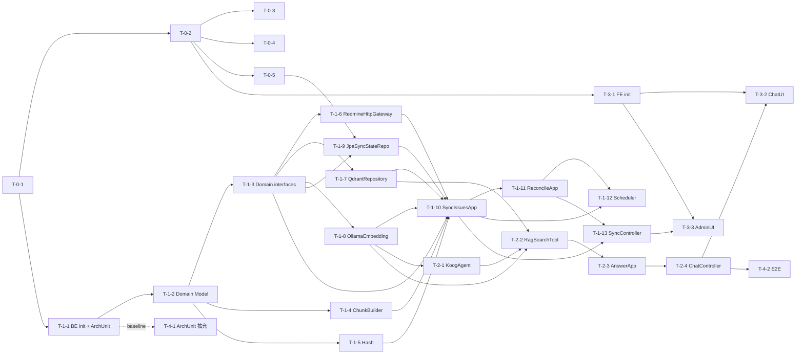

# タスク分解書 (02-tasks.md)

実装タスクの一覧。各タスクは **目的 / 前提 / 成果物 / テスト要件 / DoD** を明示する。

> **読み進める順序**: Phase 0 → Phase 1 → Phase 2 → Phase 3。Phase 4 (拡張) は任意
>
> **実装方法**: Claude Code で `/task <タスクID>` を実行 (例: `/task T-1-4`)

## 全タスク共通 DoD

詳細は `CLAUDE.md` の「厳守事項」と `.claude/rules/` を参照。要約:

- オニオンアーキテクチャ遵守 (依存方向は ArchUnit で機械検査)
- 該当層のテストコードあり (詳細は `.claude/rules/testing.md`)
- `task lint && task test` グリーン
- マジック値なし、`!!` 不使用、命名が意図を表す、関数 30 行目安

## Phase 0: プロジェクト初期化・インフラ

### T-0-1: リポジトリ雛形作成

- **目的**: ディレクトリ構成・基本ファイルを揃える
- **成果物**: `backend/`, `frontend/`, `infra/docker/`, `scripts/`, `docs/` ディレクトリ、`.env.example`, `.gitignore`, `compose.yaml` (空), `Taskfile.yaml` (空)
- **DoD**: `tree -L 2` で `01-design.md` §6.5 と整合する構成、`.gitignore` に `.env`, `node_modules/`, `build/`, `*.iml`, `.idea/`, `.gradle/`, `frontend/dist/` 等を含む

### T-0-2: Docker Compose 定義

- **目的**: ローカルで全コンポーネントを起動できる
- **成果物**: `compose.yaml`, `.env.example`
- **必要サービス**: `frontend`, `backend`, `redmine`, `redmine-db`, `qdrant`, `app-db`
- **要件**:
  - `qdrant` と `app-db` は volume 永続化
  - `host.docker.internal` で Ollama にアクセス可能 (Linux なら `extra_hosts` で `host-gateway`)
  - `depends_on: condition: service_healthy` で起動順制御
  - 各サービスに healthcheck
- **テスト要件**: `docker compose config` がエラーなく出る
- **DoD**: `docker compose up -d` で全サービス起動・healthy

### T-0-3: Taskfile 定義

- **目的**: 開発コマンド統一
- **成果物**: `Taskfile.yaml`
- **タスク一覧**: `task`, `task build`, `task up/down`, `task logs[-app/-frontend]`, `task test[-be/-fe]`, `task lint[-be/-fe]`, `task sync`, `task reconcile`, `task seed-redmine`
- **DoD**: `task` で一覧表示

### T-0-4: Redmine 初期化スクリプト

- **目的**: 初回 admin ログイン → API キー取得 → サンプルチケット投入を半自動化
- **成果物**: `scripts/seed-redmine.sh` (テストプロジェクト + チケット 10〜20 件)、`scripts/README.md` (手順書)
- **DoD**: `task seed-redmine` 後、Redmine UI で 10 件以上確認できる

### T-0-5: app-db スキーマ初期化 (Flyway)

- **目的**: `sync_state` / `sync_run` テーブルの初期化
- **成果物**: `backend/src/main/resources/db/migration/V1__init.sql` (DDL: `01-design.md` §4.2)、`V2__seed_sync_state.sql`
- **DoD**: backend 起動時に migration 完走 (T-1-9 で統合テスト)

## Phase 1: Domain 層 + Infrastructure 層 (バッチ取り込み)

### T-1-1: Backend プロジェクト初期化 + テストハーネス + ArchUnit

- **目的**: Gradle プロジェクト雛形 + 静的解析 + テスト基盤 + ArchUnit 初期セット
- **成果物**:
  - `backend/build.gradle.kts` (Kotlin DSL)、`RedmineAgentApplication.kt`
  - 依存追加 (本番):
    - `org.springframework.boot:spring-boot-starter-{web,webflux,data-jpa,actuator}`
    - `org.flywaydb:flyway-core`, `org.postgresql:postgresql`
    - `ai.koog:koog-{agents-jvm,embeddings-local,rag-vector,prompt-executor-ollama-client}:0.8.x`
    - `io.qdrant:client:<latest>`
    - `org.jetbrains.kotlinx:kotlinx-coroutines-reactor`
  - 依存追加 (テスト):
    - `org.springframework.boot:spring-boot-starter-test`
    - `io.mockk:mockk:<latest>`, `io.kotest:kotest-assertions-core:<latest>`
    - `org.testcontainers:{testcontainers,postgresql,junit-jupiter}:<latest>`
    - `org.jetbrains.kotlinx:kotlinx-coroutines-test`
    - `com.tngtech.archunit:archunit-junit5:<latest>`
  - プラグイン: Spotless (ktlint 内包), Detekt 2.x, JaCoCo
- **テスト要件**:
  - サンプル 1 本 (`HealthCheckTest`: `/actuator/health` が `UP`)
  - **ArchUnit テスト初期セット** (`arch/OnionArchitectureTest.kt`): `01-design.md` §6.6 の 7 ルールすべて
- **DoD**: `./gradlew bootRun` 8080 起動、`./gradlew test` でサンプル + ArchUnit 成功、`./gradlew spotlessCheck detekt` クリーン

### T-1-2: Domain Model 定義

- **目的**: Domain 層の中核モデル (Entity / Value Object) を定義
- **成果物** (すべて `domain/model/`): `Issue`, `Journal`, `TicketChunk`, `TicketChunkVector`, `TicketHit`, `ScoredChunk`, `SyncState`, `SyncRun`, `SyncRunKind`, `SyncRunStatus`, `SearchFilter`, `IssuePage`, `ChatMessage`, `LlmDelta`, `AgentEvent` (sealed class: Delta/Sources/Done/Error)
- **要件**: 全ファイルが標準ライブラリと kotlinx.* のみ使用 (詳細: `.claude/rules/domain-layer.md`)
- **テスト要件**: 必要なら不変条件 (`require`) のテスト
- **DoD**: ArchUnit テストの「domain.model は外部に依存しない」が pass

### T-1-3: Domain interface 定義

- **目的**: 外部システム抽象化のための interface を Domain 層に定義
- **成果物**:
  - `domain/repository/`: `TicketChunkRepository`, `SyncStateRepository`
  - `domain/gateway/`: `RedmineGateway`, `EmbeddingService`, `ChatModel`
- **要件**: シグネチャは `01-design.md` §6.4。引数・戻り値が Domain Model のみで構成 (詳細: `.claude/rules/domain-layer.md`)
- **DoD**: ArchUnit のレイヤルール pass

### T-1-4: Domain Service: ChunkBuilder

- **目的**: `Issue` から `List<TicketChunk>` への変換ロジック (純粋関数)
- **成果物**: `domain/service/ChunkBuilder.kt`
- **動作仕様**:
  - `chunkIndex=0`: description (空ならスキップ)
  - `chunkIndex=1..N`: 各 journal の `notes` (空はスキップ、連番は空除外後)
  - 1500 文字超は `subIndex` 付きで分割 + 50 文字オーバーラップ (改行優先)
  - 最大入力長 8000 文字でトリム
  - `contentHash = sha256(chunkType + content)`
- **テスト要件**:
  - 通常 (description + journals 3 件) → 4 チャンク
  - description のみ → 1 チャンク
  - description 空 + journals あり → journals だけ
  - 全空 → 0 チャンク
  - 4000 文字の description → 複数 chunk に分割
  - 同じ content なら hash 一致
  - 改行優先で分割 (改行なしは文字数フォールバック)
- **DoD**: 上記 7 ケース pass

### T-1-5: Domain Service: HashCalculator

- **目的**: SHA-256 計算の純粋関数化
- **成果物**: `domain/service/HashCalculator.kt`
- **テスト要件**: 既知入力に対する固定ハッシュ値確認 1 ケース
- **DoD**: テスト pass

### T-1-6: Infrastructure: RedmineHttpGateway

- **目的**: `RedmineGateway` を Spring `WebClient` で実装
- **成果物**:
  - `infrastructure/external/redmine/RedmineHttpGateway.kt` (`@Component`, implements `domain.gateway.RedmineGateway`)
  - `infrastructure/external/redmine/dto/{IssueDto,JournalDto,IssueListResponseDto}.kt`
  - `infrastructure/external/redmine/mapper/IssueMapper.kt`
- **要件**:
  - `X-Redmine-API-Key` ヘッダ自動付与
  - 5xx / タイムアウトで指数バックオフ 3 回リトライ
  - `?status_id=*&include=journals&sort=updated_on:desc&limit=100&offset=N&updated_on=>=ISO`
- **テスト要件 (Testcontainers)**:
  - `redmine:5` + `mysql:8` を起動、seed 投入
  - `listIssuesUpdatedSince(null, 0, 100)` で全件取れる
  - `listIssuesUpdatedSince(future, 0, 100)` で 0 件
  - `listAllIssueIds()` で ID 一覧取得
- **DoD**: 統合テスト 3 ケース pass

### T-1-7: Infrastructure: QdrantTicketChunkRepository

- **目的**: `TicketChunkRepository` を Qdrant gRPC で実装
- **成果物**:
  - `infrastructure/external/qdrant/QdrantTicketChunkRepository.kt`
  - `infrastructure/external/qdrant/PointIdGenerator.kt` (UUID v5)
  - `infrastructure/config/QdrantConfig.kt` (`QdrantClient` Bean)
- **要件**:
  - 起動時にコレクション存在確認 + 自動作成 (vector size, Cosine, payload index)
  - upsert は batch 対応 (32 points / batch)
  - search は filter (`ticket_id`, `project_id`, `status`, `tracker`) 対応
  - `findByTicketId`, `deleteByTicketId`, `deleteOrphanChunks`, `listAllTicketIds`
- **テスト要件**:
  - `PointIdGenerator` 単体: 同入力で同 UUID
  - 統合 (Testcontainers `qdrant/qdrant`):
    - コレクション自動作成
    - upsert → search でラウンドトリップ
    - filter 検索 (project_id 絞り込み) 動作
    - `deleteByTicketId` で当該 ticket の全 point 消える
    - `deleteOrphanChunks` で残すべきものは残り消すべきものだけ消える
- **DoD**: 上記テスト全 pass

### T-1-8: Infrastructure: OllamaEmbeddingService

- **目的**: `EmbeddingService` を Koog `LLMEmbedder` で実装
- **成果物**:
  - `infrastructure/config/OllamaConfig.kt` (`OllamaClient` Bean)
  - `infrastructure/external/ollama/OllamaEmbeddingService.kt`
- **要件**:
  - `LLMEmbedder(ollamaClient, OllamaEmbeddingModels.NOMIC_EMBED_TEXT)` を内包
  - context length 超過例外を `EmbeddingTooLongException` に変換
- **テスト要件**: Ollama 統合テストは作らない。例外変換ロジックのみ単体テスト
- **DoD**: 例外変換テスト pass

### T-1-9: Infrastructure: JpaSyncStateRepository

- **目的**: `SyncStateRepository` を Spring Data JPA で実装
- **成果物**:
  - `infrastructure/persistence/entity/{SyncStateEntity,SyncRunEntity}.kt`
  - `infrastructure/persistence/jpa/{SyncStateJpaRepository,SyncRunJpaRepository}.kt`
  - `infrastructure/persistence/JpaSyncStateRepository.kt`
- **テスト要件 (Testcontainers `postgres:16`)**:
  - Flyway 自動実行確認
  - load → updateLastSyncStartedAt → load で値反映
  - startRun → completeRun → listRecentRuns で履歴取得
  - failRun → `last_error` 更新
- **DoD**: 統合テスト 3 ケース以上 pass

### T-1-10: Application Service: SyncIssuesApplicationService

- **目的**: F-01 (差分同期) のユースケース実装
- **前提**: T-1-3 〜 T-1-9
- **成果物**:
  - `application/service/SyncIssuesApplicationService.kt`
  - `application/exception/{SyncAlreadyRunningException,EmbeddingTooLongException}.kt`
- **動作仕様**:
  - `suspend fun execute(mode: SyncMode = INCREMENTAL): SyncRunSummary`
  - 走行中なら `SyncAlreadyRunningException` (重複防止: `AtomicBoolean`)
  - 各 Issue 処理失敗でもループ全体を止めず、エラーは集計
  - `EmbeddingTooLongException` はチャンクを半分分割して再試行 (最大 2 回)、失敗ならスキップ
- **テスト要件 (単体・MockK で全 interface モック)**:
  - 正常系: Issue 3 件全て新規 → upsert 呼び出し回数とチャンク数が一致
  - 差分なし: 既存 hash 一致のチャンクは skip
  - チケット 1 件で journal 削除 → orphan 削除呼ばれる
  - `EmbeddingTooLongException` → 分割再試行 → 成功シナリオ
  - Redmine 5xx → リトライ後失敗 → run failed
  - 同期中の二重実行は `SyncAlreadyRunningException`
- **DoD**: 上記 6 ケース pass

### T-1-11: Application Service: ReconcileApplicationService

- **目的**: F-03 (Reconcile) のユースケース実装
- **成果物**: `application/service/ReconcileApplicationService.kt`
- **テスト要件 (単体)**:
  - Redmine ID = {1,2,3}, Qdrant ID = {1,2,3,4} → 4 が削除される
  - Redmine ID = Qdrant ID → 削除 0 件
  - Redmine 取得失敗 → run failed
- **DoD**: 上記 pass

### T-1-12: Infrastructure / scheduler: SyncScheduler

- **目的**: cron で ApplicationService を呼ぶ
- **成果物**: `infrastructure/scheduler/SyncScheduler.kt`、`@EnableScheduling` を `infrastructure/config/` の `@Configuration` に
- **要件**:
  - `@Scheduled(cron = "\${app.sync.cron}")` で Sync, `\${app.sync.reconcile-cron}` で Reconcile
  - 例外を握りつぶさずログ + 次回実行に影響を与えない
- **テスト要件**: ApplicationService をモック注入して呼び出し確認
- **DoD**: cron を `*/30 * * * * *` で連続実行ログが出る

### T-1-13: Infrastructure / web: SyncController

- **目的**: F-06, F-07 の REST API
- **成果物**:
  - `infrastructure/web/SyncController.kt`
  - `infrastructure/web/dto/{SyncStatusDto,SyncRunDto}.kt`
  - `infrastructure/web/mapper/SyncDtoMapper.kt`
- **エンドポイント**: `03-api-spec.md` §2〜§5 に準拠
- **テスト要件 (`@WebMvcTest`)**:
  - POST /api/sync 正常系 → 200 + JSON
  - POST /api/sync (走行中) → 409 + `SYNC_ALREADY_RUNNING`
  - GET /api/sync/status の JSON 構造が API 仕様と一致
  - GET /api/sync/runs?limit=N の挙動
- **DoD**: 上記 pass

## Phase 2: Koog エージェント + チャット API

### T-2-1: Infrastructure: KoogChatModel + KoogAgentFactory

- **目的**: Koog `AIAgent` を組み立てる薄いラッパー
- **成果物**:
  - `infrastructure/external/ollama/KoogChatModel.kt` (`domain.gateway.ChatModel` 実装)
  - `infrastructure/agent/KoogAgentFactory.kt`
  - `infrastructure/config/KoogConfig.kt` (`AIAgent` Bean)
- **要件**:
  - systemPrompt を `application.yml` から注入
  - 会話履歴は `conversationId` 単位で In-Memory (`ConcurrentHashMap`)
- **テスト要件**: 構築ロジックの単体テスト (Bean 構成確認)
- **DoD**: Bean 構築テスト pass + 手動で Ollama 経由のシンプル質問が通る

### T-2-2: Infrastructure / agent: RagSearchTool

- **目的**: Koog `@Tool` として RAG 検索を公開
- **成果物**: `infrastructure/agent/tool/RagSearchTool.kt`
- **シグネチャ**:
  ```kotlin
  @Tool
  @LLMDescription("...")
  suspend fun ragSearch(query: String, projectId: Int? = null, statusFilter: String? = null, limit: Int = 5): List<TicketHit>
  ```
- **動作**:
  1. `EmbeddingService.embed(query)` (Domain interface 経由)
  2. `TicketChunkRepository.search(vector, limit, filter)` (Domain interface 経由)
  3. ヒットを ticket_id でグループ化、ベストスコアの chunk を snippet
  4. `List<TicketHit>` を返却
- **テスト要件 (単体)**:
  - 同 ticket_id で複数 chunk hit → 1 件にまとめ、score 最大値
  - filter null と filter 指定の両方で正しく Port が呼ばれる
- **DoD**: 上記 pass

### T-2-3: Application Service: AnswerQuestionApplicationService

- **目的**: チャット応答ユースケース (Agent との接続点)
- **成果物**: `application/service/AnswerQuestionApplicationService.kt`
- **動作**:
  - `suspend fun execute(message: String, conversationId: String?): Flow<AgentEvent>`
  - 内部で AIAgent を呼び、Koog のイベントを domain `AgentEvent` (sealed class) にマッピング
- **注**: `AnswerQuestionApplicationService` は `AIAgent` インスタンスを直接注入される。これは `01-design.md` §6.6 で明記された妥協点 (Koog の AIAgent は単純な ChatModel 抽象では包めない)
- **テスト要件**: AIAgent をモック、主要フローと例外時の `Error` 出力
- **DoD**: 単体テスト pass

### T-2-4: Infrastructure / web: ChatController (SSE)

- **目的**: フロントとの通信エンドポイント
- **成果物**:
  - `infrastructure/web/ChatController.kt`
  - `infrastructure/web/dto/{ChatRequest,ChatEventDto}.kt`
- **要件**:
  - `POST /api/chat` SSE
  - イベント種別: `delta` / `sources` / `done` / `error`
  - リクエスト validation (message: 1〜4000 文字)
  - エラーハンドリングで `OLLAMA_UNAVAILABLE` 等のコード返却
- **テスト要件 (`@WebMvcTest` or `WebTestClient`)**:
  - SSE のイベント順序: delta* → sources → done
  - validation: 空 message で 400
  - ApplicationService 例外 → SSE で `error` イベント
- **DoD**: 上記 pass

## Phase 3: フロントエンド

### T-3-1: React + Vite 雛形 + テストハーネス

- **目的**: フロント基盤と Vitest 整備
- **成果物**:
  - `frontend/package.json` (React 18, TS, Vite, Tailwind, Vitest, @testing-library/react, MSW)
  - `frontend/vite.config.ts` (`/api` を backend にプロキシ、Vitest 設定)
  - `frontend/tsconfig.json` (`strict: true`)
  - `frontend/.eslintrc.cjs`
  - サンプルテスト 1 本
- **DoD**: `npm run dev` で 5173 起動、`npm test` 成功、`npm run lint` クリーン

### T-3-2: Chat UI

- **目的**: 質問入力 + 回答ストリーム + 引用表示
- **成果物**:
  - `frontend/src/features/chat/ChatPage.tsx`
  - `frontend/src/features/chat/components/{MessageInput,MessageList,SourcesPanel}.tsx`
  - `frontend/src/features/chat/api/chatStream.ts` (`fetch + ReadableStream`)
- **要件**:
  - SSE は `EventSource` ではなく `fetch + ReadableStream`
  - `delta` 連結、`sources` 別パネル、引用元クリックで Redmine の該当チケット
- **テスト要件 (MSW)**:
  - 入力 → 送信 → delta 連結表示 → sources 表示
  - エラー時のメッセージ表示
- **DoD**: テスト pass + 手動で実画面確認

### T-3-3: Sync 状態ダッシュボード

- **目的**: 同期状態の可視化と手動操作
- **成果物**: `frontend/src/features/admin/SyncStatusPage.tsx`、`api/syncApi.ts`
- **要件**:
  - `GET /api/sync/status` ポーリング (5 秒)
  - 「今すぐ同期」「Reconcile」ボタン
  - `GET /api/sync/runs?limit=20` で履歴表示
- **テスト要件 (MSW)**: 状態表示・ボタン押下時の API 呼び出し・409 エラー表示
- **DoD**: テスト pass + 手動確認

## Phase 4 (Optional): 拡張

### T-4-1: ArchUnit テスト拡充

- **目的**: 命名規約等のルール追加
- **成果物**: `OnionArchitectureTest.kt` の拡張
- **追加ルール例**: `infrastructure.persistence.* の @Entity は entity サブパッケージのみ`、Controller 命名末尾、ApplicationService 命名末尾

### T-4-2: E2E テスト

- **目的**: 主要シナリオ 1 本を全コンポーネント連動
- **成果物**: `e2e/SyncAndAnswerE2ETest.kt`
- **シナリオ**: Redmine seed → sync 実行 → ChatController に質問 → 引用付き応答

### T-4-3: MCP 経由の Redmine 動的操作

- **目的**: エージェントが Redmine 書き込み可能に
- **成果物**: Koog の MCP Integration、`runekaagaard/mcp-redmine` 接続、Tool 追加

### T-4-4: 評価セット + recall@k 計測

- **目的**: 検索精度の定量評価
- **成果物**: `scripts/eval/`

### T-4-5: 認証

- **成果物**: Spring Security + Basic Auth または Keycloak

## タスク依存マップ


